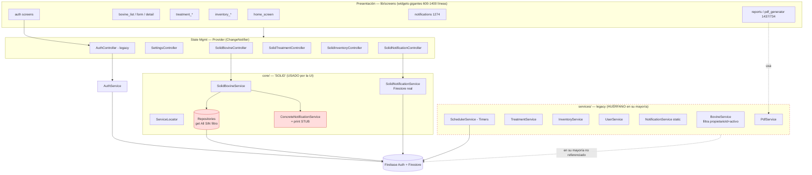

# 🔍 AUDITORÍA TÉCNICA COMPLETA — BoviData V2

> Auditoría realizada como Arquitecto de Software Senior / Tech Lead Flutter / Auditor de Código.
> Alcance: 100% de `lib/`, configuración Firebase, reglas Firestore, índices, tests y dependencias.
> Fecha: 2026-06-22 · Versión analizada: `1.0.0+1` · SDK Dart `^3.9.2`

---

## 1. Resumen Ejecutivo

BoviData V2 es una app Flutter + Firebase (Auth + Firestore) para gestión ganadera. Funcionalmente cubre bovinos, tratamientos/vacunas, inventario, mortalidad/incidencias, notificaciones, usuarios con roles, historiales médicos y reportes/PDF.

El proyecto **funciona parcialmente**, pero su estado interno es **frágil y contradictorio**. El problema estructural dominante es la **convivencia de dos arquitecturas completas y paralelas**:

| Capa | Ubicación | Estado real |
|------|-----------|-------------|
| **Legacy (correcta a nivel de datos)** | `lib/services/*.dart`, `lib/controllers/auth_controller.dart` | Filtra por `propietarioId` y `activo`, envía notificaciones reales… pero **quedó huérfana**: las pantallas ya no la usan (salvo auth, pdf, scheduler, activity). |
| **"SOLID" (la que usa la UI)** | `lib/core/**` (repositories, solid_services, solid controllers, locator, factories, builders) | Es la que consumen las pantallas, pero `getAll()` **no filtra por dueño ni por borrado lógico**, y sus notificaciones/validaciones son *stubs* que solo hacen `print()`. |

Como consecuencia directa, la migración "a SOLID puro" descrita en `COMPILATION_ERRORS_STATUS.md` **introdujo regresiones de seguridad y de funcionalidad** mientras dejaba código muerto duplicado. Los 11 tests que el repo declara "passing" **no prueban nada real** (comparan literales de string como `'SolidBovineController'.contains('Bovine')`).

**Veredicto:** base académica con intención correcta (patrones, principios), pero ejecución incompleta que hoy representa **riesgo de fuga de datos multi-tenant** y **deuda técnica alta**. No apto para producción sin las correcciones críticas de la Fase 1 del roadmap.

---

## 2. Arquitectura Actual

### 2.1 Diagrama de la arquitectura actual (real)



### 2.2 Estructura de carpetas actual

```
lib/
├── constants/         app_constants, app_styles, constants (barrel)
├── controllers/       auth_controller, settings_controller   ← legacy MVC
├── core/              ← "arquitectura SOLID" paralela
│   ├── builders/      entity_builder (usado casi solo por el ejemplo)
│   ├── controllers/   solid_*_controller (LOS que usa la UI)
│   ├── factories/     model_factory
│   ├── interfaces/    repository_interface, service_interface
│   ├── locator/       service_locator (DI manual)
│   ├── repositories/  concrete_repositories (Firestore)
│   └── services/      solid_services (+ stubs), solid_notification_service, concrete_services
├── models/            9 modelos (bovine, treatment, inventory, user, notification, activity, incident, complaint)
├── screens/           7 áreas, varias pantallas de 600-1437 líneas
├── services/          ← legacy: bovine/treatment/inventory/user/notification/activity/scheduler/pdf/auth
├── widgets/           bovine_card, search_filter_bar  (solo 2 widgets reutilizables)
├── example_patterns_implementation.dart   ← CÓDIGO MUERTO (tiene su propio main())
├── firebase_options.dart
└── main.dart
```

**Diagnóstico estructural:** no hay separación por *features* ni por *capas de dominio*. Coexisten `controllers/` (legacy) y `core/controllers/` (solid); `services/` (legacy) y `core/services/` (solid). La lógica de negocio real vive mayormente dentro de **widgets de pantalla gigantes**.

---

## 3. Problemas Detectados (por categoría)

### 3.1 Arquitectura / SOLID / Clean
- **Doble arquitectura paralela** (legacy vs SOLID) → violación grave de DRY y de cohesión; dos fuentes de verdad.
- **DIP simulado**: `ServiceLocator` es un `Map<Type,dynamic>` con getters estáticos; los controllers obtienen servicios vía singleton estático (`ServiceLocator.bovineService`) en vez de inyección por constructor → difícil de testear/mockear.
- **LSP/Tipado débil**: `IRepository.create(T)` se implementa como `create(entity)` con parámetro **dinámico** (`entity.toFirestore()` sin tipo) → se pierde seguridad de tipos.
- **Clean Architecture inexistente**: el dominio depende de Firestore (`Timestamp`, `DocumentSnapshot` en los modelos), no hay capa de aplicación/casos de uso, ni puertos/adaptadores.
- **God Widgets**: la lógica de negocio (cálculo de estadísticas, agrupaciones, filtrado) está embebida en pantallas de 600-1437 líneas.

### 3.2 Flutter / Rendimiento
- **`reports_screen.dart` (1437)**, **`notifications_screen.dart` (1274)**, **`medical_history_screen.dart` (1011)**, `treatment_detail` (892), `inventory_detail` (808), `inventory_list` (777): widgets monolíticos → rebuilds caros y mantenimiento imposible.
- **`Consumer3` / `Consumer4`** envolviendo árboles enteros → cualquier `notifyListeners()` reconstruye toda la pantalla.
- **Recarga total tras cada mutación**: `createBovine/updateBovine/deleteBovine` llaman `await loadBovines()` (re-fetch completo de la colección) en lugar de actualizar el estado local → coste Firestore + jank.
- **Variable sombreando tipo**: en `inventory_detail_screen.dart`/`inventory_form_screen.dart` el builder usa `(context, SolidInventoryController, child)` — el parámetro se llama igual que la clase. Compila, pero es un *code smell* serio.
- **`Timer.periodic` en cliente** (`SchedulerService`): solo corre con la app abierta, se duplica por dispositivo y no es un cron real.

### 3.3 Firebase / Firestore
- **Reglas permisivas (crítico)**: `bovines`, `treatments`, `inventory`, `incidents`, `activities` permiten `read, list: if request.auth != null` → **cualquier usuario autenticado lee TODOS los datos de TODAS las fincas**.
- **`getUserRole()` con default inseguro**: si el documento de usuario no existe, devuelve `'Ganadero'` → **escalada de privilegios**.
- **`notifications.create: if request.auth != null`** sin validar `usuarioId == request.auth.uid` → un usuario puede crear notificaciones a nombre de otros.
- **Fuga multi-tenant en la app**: `SolidBovineController.loadBovines()` → `getAllBovines()` → `repository.getAll()` **sin `where('propietarioId')` ni `where('activo')`** → la UI muestra ganado de otros dueños y registros borrados lógicamente.
- **`getUserRole()` hace un `get()` extra por cada operación** → coste y latencia (idealmente custom claims en el token).
- **Stats client-side**: `getBovinesStatistics`, reportes y dashboard descargan colecciones completas y agregan en cliente → coste de lecturas O(n) y no escala.
- **Índices**: existen 18 índices compuestos, pero parte del código legacy ordena en cliente "para evitar índices" → inconsistencia entre índices definidos y queries reales.

### 3.4 Calidad / Code Smells
- **Código muerto**: `example_patterns_implementation.dart` (con `main()` propio), servicios legacy huérfanos (`bovine_service`, `treatment_service`, `inventory_service`, `user_service` ya no se importan desde pantallas), `ConcreteActivityService`/`ConcreteFileService` (stubs `print`).
- **Tres sistemas de notificación** coexistiendo: `NotificationService` (estático legacy), `ConcreteNotificationService` (stub print, **el inyectado en la UI**), y `SolidNotificationService` (Firestore real).
- **`print()`** como logging en producción (scheduler, stubs).
- **`getLowStock()`** usa umbral **hardcodeado `<= 10`** ignorando `cantidadMinima` de cada ítem.
- **`SolidInventoryService`** notifica al `userId` literal `'admin'` (string mágico que no es un UID real).
- **`copyWith`/`toFirestore`/`fromX` repetidos** en los 9 modelos sin generación de código (sin `freezed`/`json_serializable`).

### 3.5 Seguridad
- **API keys de Firebase** versionadas en `firebase_options.dart`. *Matiz:* en Firebase Web/móvil la apiKey es un identificador público, **no un secreto**; el riesgo real es la combinación **reglas permisivas + sin App Check** → la key es abusable contra una base abierta.
- **Sin Firebase App Check** → backend expuesto a clientes no oficiales.
- `FIREBASE_CREDENTIALS.md` y `.env.example` contienen solo placeholders (OK), pero `.gitignore` **no excluye** `google-services.json`, `GoogleService-Info.plist` ni `.env.local`.
- Manejo de errores que **silencia excepciones** (`catch (e) { return false; }`, `// Error handled silently`) → fallos invisibles.

### 3.6 Dependencias (`pubspec.yaml`)
- Conjunto **razonable y actualizado** (firebase_core 3.6, firebase_auth 5.3, cloud_firestore 5.4, provider 6.1, pdf/printing, intl 0.20).
- `url_launcher` y `path_provider`/`shared_preferences` presentes: verificar uso real (posible dependencia poco usada).
- **No declaradas pero necesarias** para el objetivo: `get_it`/`injectable` (DI real), `go_router` (navegación), `freezed`/`json_serializable` (modelos), `mocktail`/`fake_cloud_firestore` (tests), `flutter_dotenv` (si se quiere usar `.env`).
- Sin `firebase_app_check`, sin `firebase_crashlytics` (pese a flag `ENABLE_CRASHLYTICS=true` en `.env.example`).

### 3.7 Testing
- **1 archivo de test "de arquitectura"** que solo evalúa nombres de clases como strings → **cobertura efectiva ≈ 0%**.
- `widget_test.dart` es el contador por defecto de Flutter (no aplica al app).
- Sin tests de repositorios, servicios, controllers, reglas Firestore ni golden tests.

---

## 4. Hallazgos Críticos 🔴 (prioridad máxima)

| # | Hallazgo | Impacto | Evidencia |
|---|----------|---------|-----------|
| C1 | **Fuga de datos multi-tenant en reglas Firestore**: lectura/listado de `bovines/treatments/inventory/incidents/activities` para cualquier usuario autenticado. | Confidencialidad rota entre fincas/clientes. | `firestore.rules:18-19,26-27,34-35,59-60,67-68` |
| C2 | **Escalada de privilegios**: `getUserRole()` retorna `'Ganadero'` por defecto si no hay doc. | Permisos de escritura/borrado indebidos. | `firestore.rules:76-79` |
| C3 | **La UI ignora el filtrado por dueño y por `activo`**: `repository.getAll()` se usa en listados y dashboard. | El usuario ve ganado ajeno y borrados lógicos. | `concrete_repositories.dart:44-52`, `solid_bovine_controller.dart:51` |
| C4 | **Notificaciones rotas**: el servicio inyectado en los flujos SOLID (`ConcreteNotificationService`) solo hace `print()`. | Eventos de negocio (alta/baja/tratamiento/stock) no notifican. | `solid_services.dart:298-317`, `service_locator.dart:45` |
| C5 | **`notifications.create` sin validar propietario** + posibilidad de crear notificaciones para terceros. | Spoofing/spam de notificaciones. | `firestore.rules:53` |
| C6 | **Sin App Check + base abierta**: claves cliente + reglas laxas. | Abuso del backend y costos. | `firebase_options.dart`, `firestore.rules` |

## 5. Hallazgos Importantes 🟠

| # | Hallazgo | Evidencia |
|---|----------|-----------|
| I1 | Doble arquitectura paralela (legacy vs SOLID) y servicios legacy huérfanos. | `services/*` vs `core/*` |
| I2 | Tests sin valor real; falsa sensación de cobertura. | `test/solid_principles_test.dart` |
| I3 | `ServiceLocator.initialize()` llamado **dos veces** en `main()`. | `main.dart:24,27` |
| I4 | Widgets gigantes (1437/1274/1011…) con lógica de negocio embebida. | `screens/reports`, `screens/notifications`, … |
| I5 | Recarga completa de colección tras cada CRUD (coste + jank). | `solid_*_controller.dart` (`await loadX()`) |
| I6 | `getLowStock()` con umbral hardcodeado `<= 10` ignora `cantidadMinima`. | `concrete_repositories.dart:319-328` |
| I7 | `SchedulerService` con `Timer.periodic` en cliente (no es cron real). | `scheduler_service.dart` |
| I8 | Modelos acoplados a Firestore (`Timestamp`, `DocumentSnapshot`). | `models/*` |
| I9 | Estadísticas/reportes calculados en cliente sobre colecciones completas. | `bovine_service.dart:424`, `reports_screen.dart` |
| I10 | `getUserRole()` agrega un `get()` por operación (sin custom claims). | `firestore.rules:76` |

## 6. Hallazgos Menores 🟡

| # | Hallazgo |
|---|----------|
| M1 | `print()` como logging en producción (scheduler, stubs). |
| M2 | Variable de builder con el mismo nombre que la clase (`SolidInventoryController`). |
| M3 | `.gitignore` no excluye `google-services.json` / `.env.local`. |
| M4 | `example_patterns_implementation.dart` (código muerto con `main()` propio). |
| M5 | `analysis_options.yaml` sin reglas estrictas extra (sin `prefer_const`, `avoid_print`, etc.). |
| M6 | Duplicación de `copyWith/fromMap/fromFirestore/toFirestore` en 9 modelos (sin codegen). |
| M7 | Solo 2 widgets verdaderamente reutilizables en `widgets/`. |
| M8 | Navegación con `Navigator.push` disperso; solo 2 rutas nombradas. |
| M9 | `ConcreteActivityService` / `ConcreteFileService` stubs no usados. |
| M10 | `macos` reutiliza `appId` de iOS en `firebase_options.dart`. |

---

## 7. Calificación del Proyecto

| Categoría | Nota /10 | Justificación |
|-----------|:--------:|---------------|
| Arquitectura | **3.5** | Intención de patrones, pero doble arquitectura, DIP simulado y dominio acoplado a Firestore. |
| Código | **4.0** | Legible, pero duplicado, con código muerto, stubs y smells. |
| Escalabilidad | **3.0** | Stats client-side, recargas completas, scheduler en cliente. |
| Seguridad | **2.0** | Fuga multi-tenant, escalada de privilegios, sin App Check. |
| Firebase (Auth/config) | **5.0** | Auth correcto (verificación email, reauth, manejo de errores). |
| Firestore (modelo/reglas/queries) | **3.0** | Índices definidos, pero reglas laxas y queries sin filtro de dueño. |
| Rendimiento | **3.5** | Widgets gigantes, rebuilds amplios, re-fetch tras cada CRUD. |
| Testing | **1.0** | Tests sin valor real; cobertura ≈ 0%. |
| Mantenibilidad | **3.0** | Dos arquitecturas, archivos enormes, baja cohesión. |

### Nota Final del Proyecto: **3.1 / 10**

> Cálculo: promedio simple de las 9 categorías = (3.5+4.0+3.0+2.0+5.0+3.0+3.5+1.0+3.0)/9 ≈ **3.11**.
> Ponderando seguridad y testing (mayor peso de negocio), la nota efectiva se mantiene en el rango **3.0–3.3**.

### Riesgos ordenados por prioridad
1. **Críticos (acción inmediata):** C1, C2, C3, C5, C6, C4 — fuga de datos, escalada de privilegios, notificaciones rotas. *Bloquean producción.*
2. **Medios:** I1, I4, I5, I9, I2 — deuda arquitectónica, rendimiento y ausencia de pruebas.
3. **Menores:** todo el bloque M — limpieza, logging, lints y codegen.

---

## 8. Conclusión

BoviData V2 demuestra conocimiento de patrones y principios, pero su **migración a "SOLID" quedó a medias** y produjo una base con **dos arquitecturas en conflicto**, **fugas de seguridad reales** y **pruebas ficticias**. La buena noticia: el dominio es claro y acotado, por lo que una **reorganización por features con arquitectura hexagonal** (ver `PLAN_MIGRACION_HEXAGONAL.md`) y la corrección inmediata de las reglas Firestore convertirían este proyecto en una base sólida y escalable. Las prioridades absolutas son **C1–C6**; el resto se aborda en el `ROADMAP.md`.
