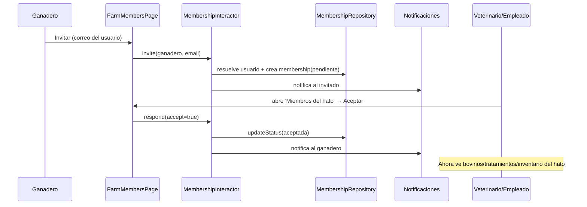

# 🐄 Modelo de Hato y Membresías — Scoping Seguro

Documento de la funcionalidad implementada: **acceso por hato mediante invitaciones**.
Implementada como **feature hexagonal** en `lib/features/membership/`.

---

## 1. Concepto

- Un **Ganadero** es dueño de un **hato** (su `propietarioId` = su `uid`).
- Un **Veterinario** o **Empleado** **no ve nada** del hato hasta que el ganadero
  lo **invita** y el invitado **acepta** (la invitación llega como notificación).
- Al aceptar, el miembro ve los datos (**bovinos, tratamientos, inventario**) de
  ese hato. El ganadero puede **revocar** el acceso en cualquier momento.



## 2. Estructura (hexagonal)

```
lib/features/membership/
├── domain/
│   ├── entities/membership.dart         # entidad pura + MembershipStatus
│   └── ports/membership_repository.dart  # interfaz (puerto)
├── application/
│   └── membership_interactor.dart        # casos de uso: invite/respond/revoke
├── infrastructure/
│   ├── dto/membership_dto.dart           # mapeo Firestore <-> entidad
│   └── repositories/membership_repository_impl.dart
└── presentation/
    ├── controllers/membership_controller.dart
    └── pages/farm_members_page.dart
lib/core/access/farm_access_service.dart   # resuelve hatos accesibles
```

## 3. Modelo de datos

**Colección `memberships`** — id determinista `"${ganaderoId}_${memberId}"`:

| Campo | Descripción |
|-------|-------------|
| `ganaderoId` / `ganaderoNombre` | Dueño del hato que invita |
| `memberId` / `memberEmail` / `memberNombre` / `memberRol` | Usuario invitado |
| `estado` | `pendiente` · `aceptada` · `rechazada` · `revocada` |
| `fechaCreacion` / `fechaRespuesta` | Auditoría |

**Campo `propietarioId`** añadido a `treatments`, `inventory`, `incidents` (los
bovinos ya lo tenían). Se **estampa automáticamente** al crear:
- Bovino / inventario → hato del usuario actual (`FarmAccessService.currentFarmOwnerId`).
- Tratamiento → hereda el `propietarioId` del bovino al que aplica.

## 4. Lectura con scoping

`FarmAccessService.accessibleOwnerIds()` = `{ uid }` ∪ `{ hatos con membresía aceptada }`.
Los repositorios exponen `getByOwners(ids)` (`whereIn`, sin índices nuevos) y los
controladores cargan vía `getAccessible*()`.

## 5. Seguridad (Firestore Rules)

`hasFarmAccess(ownerId)` concede acceso si es el propio hato o existe membresía
**aceptada** (documento determinista verificable con `exists()`/`get()`):

```
function hasFarmAccess(ownerId) {
  return isSignedIn() && (
    ownerId == '' ||                         // dato heredado (transitorio)
    ownerId == request.auth.uid ||
    (exists(membershipPath(ownerId)) &&
     get(membershipPath(ownerId)).data.estado == 'aceptada')
  );
}
```

## 6. Limitaciones conocidas / siguientes pasos

1. **Backfill de datos previos:** los documentos creados antes de este cambio
   tienen `propietarioId == ''`. La regla los permite de forma transitoria
   (`ownerId == ''`) para no romper datos antiguos, pero **no aparecen en los
   listados** (que consultan por `whereIn`). Acción recomendada: ejecutar un
   script de backfill que asigne `propietarioId` a los documentos históricos y
   luego **endurecer la regla** eliminando la cláusula `ownerId == ''`.
2. **Costo de reglas:** `hasFarmAccess` hace un `get()` de membresía por documento
   leído. Para hatos con muchos miembros/listas grandes conviene migrar el rol y
   los hatos accesibles a **custom claims** del token (set por Cloud Function al
   aceptar/revocar), eliminando los `get()` en reglas.
3. **`whereIn` admite hasta 30 hatos.** Si un veterinario pertenece a más de 30
   hatos, habrá que paginar/particionar las consultas.
4. **Incidencias/mortalidad:** ya tienen `propietarioId` en el modelo, pero su
   flujo de lectura aún no está acotado por hato (no hay controlador dedicado);
   queda pendiente cuando se construya la feature `mortality`.

---

## 7. Estado de la migración hexagonal

| Feature | Estado |
|---------|--------|
| **membership** | ✅ Migrada (referencia hexagonal completa) |
| **authentication** | ✅ Migrada (`features/authentication/{domain,infrastructure,presentation}`, puerto `AuthRepository`) |
| animals · treatments · inventory | 🟡 Capa de datos ya en capas (repos/servicios/controllers en `core/`); pendiente **dividir los archivos compartidos** (`concrete_repositories.dart`, `solid_services.dart`) por feature y mover controllers + pantallas a `features/*` |
| notifications · mortality · users · dashboard | 🔴 Pendientes de migrar siguiendo el patrón |

**Convención adoptada:** imports de paquete (`package:bovidata_new/...`) en el código
migrado, para que las reubicaciones sean robustas. Limpieza: eliminados servicios
legacy muertos (`bovine_service`, `treatment_service`), `core/services/concrete_services`,
barrel `screens/screens.dart` y `.md` de estados obsoletos.

El patrón a replicar por feature está descrito en
[PLAN_MIGRACION_HEXAGONAL.md](PLAN_MIGRACION_HEXAGONAL.md). `membership` y
`authentication` sirven como plantillas concretas y verificables.
