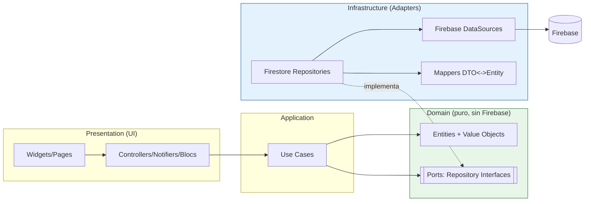
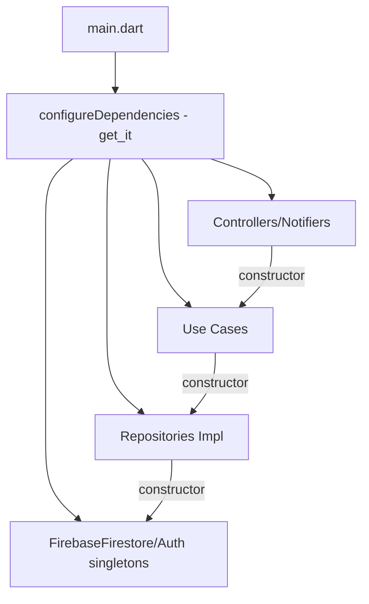

# 🧭 PLAN DE MIGRACIÓN A ARQUITECTURA HEXAGONAL — BoviData V2

> Objetivo: máxima mantenibilidad, escalabilidad empresarial, testing fácil y separación estricta de capas.
> Enfoque: **Arquitectura Hexagonal (Ports & Adapters) + Clean Architecture + SOLID + DDD Lite + Repository Pattern + Inyección de Dependencias real (`get_it`/`injectable`)**.

---

## 1. Principios rectores

1. **El dominio no conoce a Firebase.** Nada de `Timestamp`, `DocumentSnapshot` ni `cloud_firestore` en `domain/`.
2. **La dependencia apunta hacia adentro.** `presentation → application → domain`; `infrastructure` implementa puertos del dominio.
3. **Un solo modelo de verdad por concepto:** Entidad de dominio (pura) ↔ DTO/Model de infraestructura (mapea Firestore).
4. **Puertos (interfaces) en el dominio; adaptadores (implementaciones) en infraestructura.**
5. **Casos de uso explícitos** en `application/` (un caso de uso = una intención de negocio).
6. **DI por constructor**, registrada con `get_it`. Se elimina el `ServiceLocator` con getters estáticos.



---

## 2. Nueva estructura de carpetas (propuesta)

```
lib/
├── main.dart
├── app/
│   ├── app.dart                 # MaterialApp, theming, localización
│   ├── router/                  # go_router (rutas centralizadas, guards de auth/rol)
│   └── di/                      # injection.dart (get_it/injectable), bootstrap
│
├── core/                        # transversal, SIN lógica de negocio
│   ├── error/                   # Failure, Exceptions, Result<T>
│   ├── usecase/                 # UseCase<Input,Output> base
│   ├── utils/                   # formatters, date utils, validators
│   ├── constants/               # rutas de colecciones, enums, strings
│   └── theme/                   # app_styles, colors, dimensions
│
├── shared/                      # widgets/UI reutilizable de verdad
│   ├── widgets/                 # buttons, cards, empty_state, loaders, search_bar
│   └── extensions/
│
└── features/
    ├── authentication/
    │   ├── domain/
    │   │   ├── entities/        user.dart (entidad pura)
    │   │   ├── value_objects/   email.dart, role.dart
    │   │   └── ports/           auth_repository.dart (interfaz)
    │   ├── application/
    │   │   └── usecases/        sign_in, register, sign_out, reset_password, update_profile
    │   ├── infrastructure/
    │   │   ├── dto/             user_dto.dart (Firestore <-> entity)
    │   │   ├── datasources/     firebase_auth_datasource.dart
    │   │   └── repositories/    auth_repository_impl.dart
    │   └── presentation/
    │       ├── controllers/     auth_controller.dart (ChangeNotifier/Bloc)
    │       └── pages/           login, register, forgot_password, profile, settings
    │
    ├── animals/                 # (bovinos) misma estructura domain/application/infrastructure/presentation
    ├── vaccines/                # vacunas (puede ser submódulo de treatments o propio)
    ├── treatments/
    ├── inventory/
    ├── mortality/               # mortalidad e incidencias
    ├── users/                   # gestión de usuarios/roles (admin)
    ├── notifications/
    └── dashboard/               # reportes, estadísticas, PDF (consume otros features vía use cases)
```

> **Regla de oro:** un feature **no importa** archivos `infrastructure/` o `presentation/` de otro feature. La comunicación entre features se hace por **casos de uso** o por contratos en `domain/ports`.

---

## 3. Diseño por capa (plantilla aplicable a cada módulo)

### 3.1 Domain (puro)
```dart
// features/animals/domain/entities/animal.dart
class Animal {
  final String id;
  final String name;
  final String breed;
  final Sex sex;            // value object/enum
  final DateTime birthDate;
  final double weightKg;
  final HealthStatus status;
  final String ownerId;
  final bool active;
  const Animal({...});
  int get ageInMonths => ...;   // lógica de negocio pura, testeable sin Firebase
}

// features/animals/domain/ports/animal_repository.dart
abstract interface class AnimalRepository {
  Future<List<Animal>> getByOwner(String ownerId);
  Stream<List<Animal>> watchByOwner(String ownerId);
  Future<String> create(Animal animal);
  Future<void> update(Animal animal);
  Future<void> softDelete(String id);
}
```

### 3.2 Application (casos de uso)
```dart
// features/animals/application/usecases/get_my_animals.dart
class GetMyAnimals implements UseCase<List<Animal>, NoParams> {
  final AnimalRepository repo;
  final AuthSession session;       // provee ownerId actual
  GetMyAnimals(this.repo, this.session);
  @override
  Future<Result<List<Animal>>> call(NoParams _) =>
      guard(() => repo.getByOwner(session.currentUserId));
}
```

### 3.3 Infrastructure (adaptador Firestore)
```dart
// features/animals/infrastructure/repositories/animal_repository_impl.dart
class AnimalRepositoryImpl implements AnimalRepository {
  final FirebaseFirestore db;
  AnimalRepositoryImpl(this.db);

  @override
  Future<List<Animal>> getByOwner(String ownerId) async {
    final snap = await db.collection('bovines')
        .where('propietarioId', isEqualTo: ownerId)   // ← filtro de dueño SIEMPRE
        .where('activo', isEqualTo: true)              // ← respeta borrado lógico
        .orderBy('fechaCreacion', descending: true)
        .get();
    return snap.docs.map(AnimalDto.fromDoc).map((d) => d.toEntity()).toList();
  }
}
```

### 3.4 Presentation
```dart
// features/animals/presentation/controllers/animal_list_controller.dart
class AnimalListController extends ChangeNotifier {
  final GetMyAnimals _getMyAnimals;   // inyectado por constructor (testeable)
  AnimalListController(this._getMyAnimals);
  // estado inmutable + selectores; sin acceso directo a Firestore
}
```

---

## 4. Mapeo módulo por módulo (estado actual → destino)

| Módulo destino | Origen actual | Acciones clave |
|----------------|---------------|----------------|
| **authentication** | `controllers/auth_controller`, `services/auth_service` | Extraer entidad `User` pura + `AuthRepository` port; custom claims para rol. |
| **animals** (bovinos) | `core/controllers/solid_bovine_controller`, `core/services/solid_services`, `core/repositories`, `services/bovine_service` (legacy), `models/bovine_model` | **Unificar a UNA implementación** con filtro `propietarioId`+`activo`; eliminar legacy huérfano. |
| **vaccines** | parte de `treatments` (tipo "Vacunación") | Modelar como subtipo/categoría de tratamiento o feature propio si crece. |
| **treatments** | `solid_treatment_*`, `services/treatment_service`, `models/treatment_model` | Casos de uso: programar, completar, vencidos; notificar al dueño real. |
| **inventory** | `solid_inventory_*`, `services/inventory_service`, `models/inventory_model` | `getLowStock` por `cantidadMinima` real; alertas a UID válidos. |
| **mortality** | `models/incident_model`, `models/complaint_model`, reglas `incidents` | Feature de mortalidad/incidencias con su repositorio. |
| **users** | `services/user_service`, reglas `users` | Gestión admin de roles; reglas con validación de admin. |
| **notifications** | `core/services/solid_notification_service` (real), `services/notification_service` (legacy), stub | **Consolidar en UN solo servicio** (el de Firestore real) y eliminar el stub `print`. |
| **dashboard** | `screens/reports`, `screens/reports/pdf_generator`, `services/pdf_service` | Casos de uso de agregación; mover stats a Cloud Functions / aggregation queries. |

---

## 5. Inyección de dependencias (reemplazo del ServiceLocator)



- `get_it` + `injectable` (o registro manual) sustituyen `ServiceLocator`.
- Los controllers reciben **casos de uso** por constructor → mockeables en tests.
- Se elimina el doble `ServiceLocator.initialize()` de `main.dart`.

---

## 6. Estrategia de seguridad (Firestore) destino

- Reglas con **scoping por `propietarioId`** en lectura/listado de `bovines/treatments/inventory/incidents`.
- `getUserRole()` que **niega por defecto** (sin doc → sin permisos), idealmente vía **custom claims** en el token (set por Cloud Function al cambiar rol).
- `notifications`: `create` solo si `request.resource.data.usuarioId == request.auth.uid` o emisor con rol autorizado.
- Activar **Firebase App Check** y **Crashlytics**.

---

## 7. Beneficios esperados

- **Testabilidad:** dominio y casos de uso testeables sin Firebase (con `mocktail`/`fake_cloud_firestore`).
- **Escalabilidad:** features aisladas, equipos paralelos, agregaciones server-side.
- **Seguridad:** una sola ruta de datos con filtros correctos + reglas estrictas.
- **Mantenibilidad:** fin de la doble arquitectura, widgets pequeños, modelos con codegen.

Ver el cronograma en `ROADMAP.md` y el inventario de deuda en `DEUDA_TECNICA.md`.
