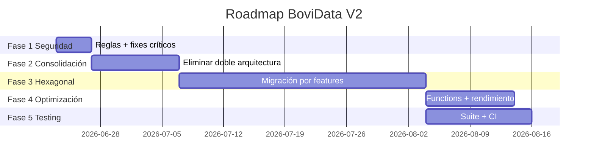
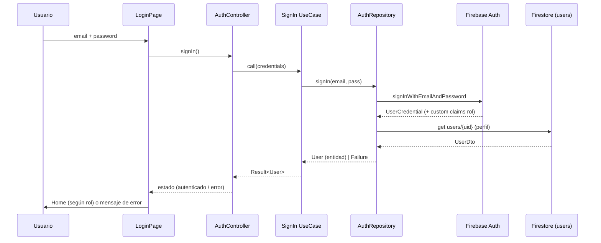
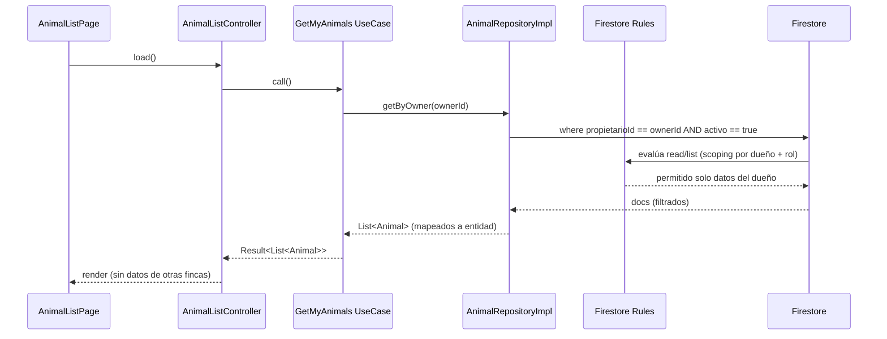

# 🗺️ ROADMAP DE IMPLEMENTACIÓN — BoviData V2

Plan de refactorización en 5 fases. Para cada fase: **riesgo**, **tiempo estimado**, **archivos afectados** y **beneficio esperado**.

---

## FASE 1 — Cambios rápidos y seguros (estabilización + seguridad crítica)

| Atributo | Detalle |
|----------|---------|
| **Riesgo** | Bajo (cambios localizados) — *salvo reglas Firestore, que requieren prueba con emulador.* |
| **Tiempo** | 2–4 días |
| **Archivos** | `firestore.rules`, `main.dart`, `core/repositories/concrete_repositories.dart`, `core/services/solid_services.dart`, `core/locator/service_locator.dart`, `lib/example_patterns_implementation.dart`, `.gitignore`, `analysis_options.yaml` |

**Acciones**
1. 🔴 Corregir reglas Firestore: scoping por `propietarioId`, `getUserRole()` que niega por defecto, `notifications.create` validado (TD-01, TD-02, TD-05).
2. 🔴 Hacer que la UI use `getByOwner` + `activo` en lugar de `getAll()` (TD-03).
3. 🔴 Inyectar el servicio de notificación real (Firestore) en los flujos SOLID; eliminar stub `print` (TD-04).
4. 🟠 Eliminar `ServiceLocator.initialize()` duplicado (TD-10).
5. 🟡 Borrar `example_patterns_implementation.dart`; renombrar variable-clase; ampliar `.gitignore` y lints (TD-18, TD-20, TD-21, TD-22).
6. Activar Firebase App Check (TD-06).

**Beneficio:** cierra las fugas de datos y restaura notificaciones — desbloquea un piloto seguro.

---

## FASE 2 — Refactorización moderada (consolidación)

| Atributo | Detalle |
|----------|---------|
| **Riesgo** | Medio |
| **Tiempo** | 1–2 semanas |
| **Archivos** | `lib/services/*` (legacy), `lib/core/services/*`, controllers, `getLowStock`, modelos |

**Acciones**
1. Eliminar la **arquitectura legacy huérfana** tras migrar su lógica útil (búsquedas, filtros, stats) (TD-07, TD-08).
2. Consolidar los **tres sistemas de notificación** en uno solo (TD-24).
3. Reemplazar recarga total post-CRUD por actualización local/streams (TD-12).
4. `getLowStock` por `cantidadMinima`; alertas a UID válidos (TD-13).
5. Logging con `logger` en vez de `print` (TD-19); dejar de silenciar excepciones (TD-26).

**Beneficio:** una sola fuente de verdad, menos lecturas Firestore, código más predecible.

---

## FASE 3 — Migración a Hexagonal (reestructuración por features)

| Atributo | Detalle |
|----------|---------|
| **Riesgo** | Alto (mueve casi todo el código) — hacer **feature por feature**, no big-bang. |
| **Tiempo** | 3–5 semanas |
| **Archivos** | Todo `lib/` → reorganizado en `features/*` con `domain/application/infrastructure/presentation` |

**Acciones** (ver `PLAN_MIGRACION_HEXAGONAL.md`)
1. Introducir `get_it`/`injectable`, `core/error`, `core/usecase`, `app/router` (go_router).
2. Migrar en orden: `authentication` → `animals` → `treatments`/`vaccines` → `inventory` → `notifications` → `mortality` → `users` → `dashboard`.
3. Por feature: entidad pura + puerto + casos de uso + DTO/mapper + repositorio impl + controller delgado.
4. Sustituir `ServiceLocator` estático por DI por constructor (TD-17); separar entidad de DTO (TD-15).

**Beneficio:** capas estrictas, features aisladas, base testeable y escalable.

---

## FASE 4 — Optimización (rendimiento y escalabilidad)

| Atributo | Detalle |
|----------|---------|
| **Riesgo** | Medio |
| **Tiempo** | 1–2 semanas |
| **Archivos** | `dashboard/*`, `scheduler`, pantallas grandes, Cloud Functions (nuevo) |

**Acciones**
1. Mover agregaciones/reportes a **aggregation queries** o **Cloud Functions** con contadores (TD-16).
2. Migrar `SchedulerService` a **Cloud Functions programadas** (cron real) (TD-14).
3. Romper widgets gigantes en sub-widgets `const`; usar `Selector`/`context.select` para reducir rebuilds (TD-11).
4. `freezed` + `json_serializable` para modelos (TD-23).

**Beneficio:** menor coste Firestore, UI fluida, notificaciones server-side fiables.

---

## FASE 5 — Testing (calidad sostenible)

| Atributo | Detalle |
|----------|---------|
| **Riesgo** | Bajo |
| **Tiempo** | 1–2 semanas (continuo) |
| **Archivos** | `test/**`, `integration_test/**`, CI |

**Acciones**
1. Eliminar el test ficticio (TD-09); añadir `mocktail`, `fake_cloud_firestore`.
2. **Unit:** entidades (edad, stock), casos de uso, mappers.
3. **Repository:** contra `fake_cloud_firestore`.
4. **Reglas Firestore:** suite con el emulador (verifica scoping y roles).
5. **Widget/golden** en pantallas clave; **integration** del flujo auth→listado→CRUD.
6. CI (GitHub Actions) con `flutter analyze` + `flutter test --coverage` y umbral mínimo.

**Beneficio:** prevención de regresiones (incluidas las de seguridad), despliegues con confianza.

---

## Línea de tiempo

---

## Flujo de Autenticación (objetivo)

## Flujo Firestore (objetivo: lectura segura de animales)

